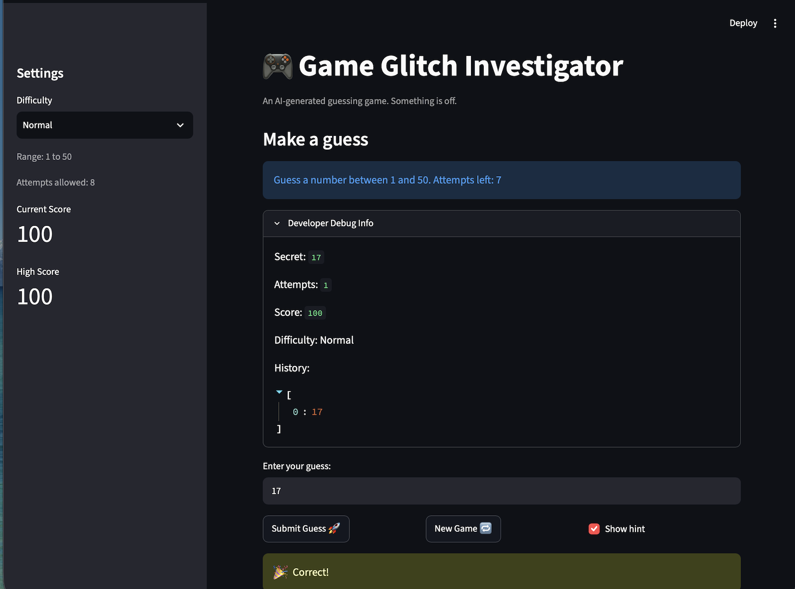
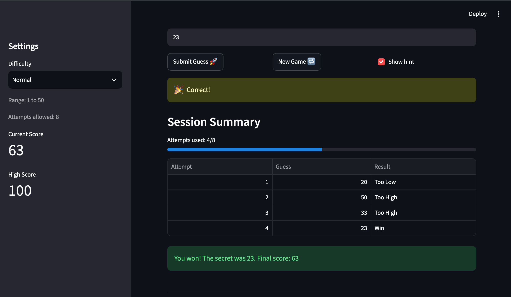

# 🎮 Game Glitch Investigator: The Impossible Guesser

## 🚨 The Situation

The starter project was an AI-generated number guessing game built with
Streamlit. It contained state, input-validation, hint, and scoring bugs that
made the game unreliable.

Before the repairs:

- Winning was unreliable.
- The hints pointed in the wrong direction.
- The secret and game state changed unexpectedly.

## 🛠️ Setup

1. Install dependencies: `pip install -r requirements.txt`
2. Run the app: `python -m streamlit run app.py`

## 🕵️‍♂️ Your Mission

1. **Play the game.** Open the "Developer Debug Info" tab in the app to see the secret number. Try to win.
2. **Find the State Bug.** Why does the secret number change every time you click "Submit"? Ask ChatGPT: *"How do I keep a variable from resetting in Streamlit when I click a button?"*
3. **Fix the Logic.** The hints ("Higher/Lower") are wrong. Fix them.
4. **Refactor & Test.** - Move the logic into `logic_utils.py`.
   - Run `pytest` in your terminal.
   - Keep fixing until all tests pass!

## 📝 Document Your Experience

- [x] Describe the game's purpose.

    A number guessing game built with Streamlit. The player picks a difficulty, then tries to guess a secret number within a limited number of attempts. After each guess, the game says whether to go higher or lower.

- [x] Detail which bugs you found.

    1. Changing difficulty kept the old secret, even when that secret was outside the new difficulty's range.
    2. New Game always chose a secret from 1–100 instead of using the selected difficulty's range.
    3. New Game reset only the attempts and secret. It did not reset the score, status, or history, so a finished game could stay finished.

    I also found and fixed backwards hints, text-based number comparisons, swapped Normal and Hard ranges, a hardcoded range prompt, incorrect attempt and score updates, and missing validation for invalid, decimal, and out-of-range guesses.

- [x] Explain what fixes you applied.

    - The secret stays in `st.session_state` during normal reruns, and `secret_difficulty` records which difficulty it belongs to.
    - Changing difficulty calls `reset_game` and generates a secret inside the new difficulty's range.
    - New Game also calls `reset_game`, which resets the secret, attempts, score, status, and history together while preserving the High Score.
    - I also moved the game logic into `logic_utils.py` and fixed the hints, numeric comparisons, ranges, prompt, validation, attempt counting, and scoring.
    - I fixed the starter tests and added passing tests for the repairs, the live Streamlit game, and the stretch features.

## 📸 Demo Walkthrough

Example Normal game:

1. User guesses 20 → "Go HIGHER!" (score: 88)
2. User guesses 40 → "Go LOWER!" (score: 75)
3. User guesses 75 → "Guess must be between 1 and 50." No attempt used.
4. User guesses 32 → "You won!" with balloons (score: 75)
5. The High Score updates to 75 (when the previous saved best was below 75). New Game resets attempts, score, and history while preserving the High Score.

**Screenshot** *(optional)*:



## 🧪 Test Results

```
$ venv/bin/python -m pytest -q
.....................................                                    [100%]
37 passed in 1.94s
```

## 🚀 Stretch Features

### Enhanced Game UI

`app.py` displays the current score in the sidebar along with a live attempts
progress bar and session table. `build_guess_summary` in `logic_utils.py`
creates rows containing the attempt number, guess, and result. The score, range
message, debug information, progress bar, and summary refresh from the same game
state.



### Advanced Edge-Case Testing

`parse_guess` rejects empty, non-numeric, decimal, negative, and extremely large
inputs. The parameterized test runs each input as a separate pytest case while
keeping the assertion concise.

### Agent Mode: File-Backed High Score

`load_high_score` and `save_high_score` in `logic_utils.py` store and load the best score. The score is stored in `high_score.txt`, displayed in the sidebar, preserved by New Game, and loaded by a fresh app session. The runtime score file is excluded through `.gitignore`.

### Professional Documentation and Style

Every function in `logic_utils.py` has complete type hints and a docstring. `ruff check --select E,W,F,I app.py logic_utils.py tests/test_game_logic.py` reports `All checks passed!`, and `ruff format --check` reports all three files formatted.
